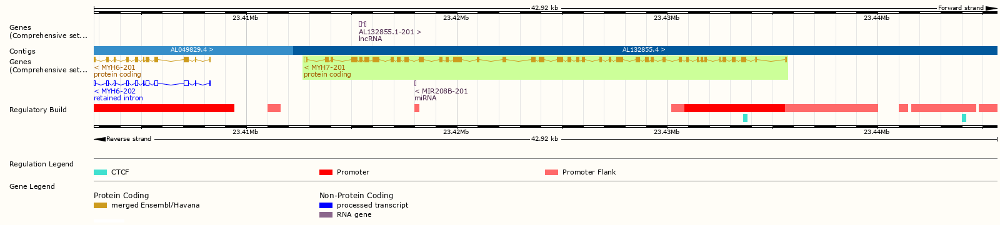

# Background

- Reverse transcriptase followed by quantitative polymerase chain reaction (RT-qPCR or qPCR) can be used to quantify abundance of RNA from a biological sample.

--

- This is the technique most commonly used to determine **targeted gene expression** 

---

- Others techniques include northern blotting (old), micro arrays (specific probes, many target) and RNA-seq (many targets)

# One-step vs. two-step qPCR


<font size=2>Image source: thermofischer.com</font>
---

.left-column[
cDNA synthesis: we used a mixture of random hexamer and Oligo dT primers
]

.right-column[
 

]

<font size=2>Image source: thermofischer.com</font>
---


# The qPCR reaction leads to exponential amplification of target cDNA

- mRNA sequences are known from mapping of the human genome.
- Specific primers are designed to capture a specific gene.



---


.left-column[
Amplification of genomic DNA is avoided in primer design.
]

.right-column[
 

]

<font size=2>Image source: thermofischer.com</font>
---

# A simulation

Products doubles with each cycle.

```{r, echo = FALSE, warning = FALSE, message = FALSE, dpi = 300, fig.align='center', fig.width = 6, fig.height = 4}
library(tidyverse)

qpcr_simulation <- function(start = 2){
  
  n <- seq(1:40)
 a <- vector()
 start <- start

for(i in 1:length(n)) {
  
  
  if(i == 1) a[i] <- start
  if(i > 1) a[i] <- a[i-1] * 2
  
  
}
  
  return(a)

}


data.frame(gene.a = qpcr_simulation(start = 300), 
           gene.b = qpcr_simulation(start = 300*10), 
           cycle = seq(1:40)) %>%
  pivot_longer(names_to = "Gene", values_to = "fluo", cols = gene.a:gene.b) %>%
  
  ggplot(aes(cycle, fluo, fill = Gene)) + 

  scale_y_continuous(limits = c(0, 10^10)) +
  
  geom_hline(yintercept = 10^9) +
  annotate("text", x = 1, y = 10^9.3,
           hjust = 0,
           label = "Threshold\nBackground Fluorescence") +
  
  geom_point( shape = 21) +
  theme_minimal() +
  labs(y = "Fluorescence", 
           x = "Cycle") +
  theme(axis.text.y = element_blank())
  


```

---

# The quantification cycle is the primary outcome of a qPCR experiment

- The cycle where fluorescence reaches above the background noise.
- May be set as an arbitrary threshold based on baseline noise
- Can also be calculated from modeling the relationship between cycles and fluorescence

---
# Installing `qpcrpal`

```{r, eval = FALSE, echo = TRUE}
install.package(qpcR) # qpcR package

library(remotes)
remotes::install_github("dhammarstrom/qpcrpal", build_vignettes = TRUE)

```

---

# Using `qpcrpal`

- `qpcrpal` can be used to analyze "multi-plate" experiments

```{r, echo = FALSE, message = FALSE, warning = FALSE, eval = TRUE}
library(qpcR)
library(qpcrpal)
library(parallel)

qpcr.dat <- read_quant5("./data/qpcr_data/Group2.xls", 
                        skip = 47) 
models <- model_qpcr(qpcr.dat)

analyzed.models <- analyze_models(models)

```


```{r, echo = TRUE, message = FALSE, warning = FALSE, eval = FALSE}
library(qpcR)
library(qpcrpal)
library(parallel)

qpcr.dat <- read_quant5("./data/qpcr_data/Group2.xls", 
                        skip = 47) 

models <- model_qpcr(qpcr.dat)

analyzed.models <- analyze_models(models)

```


---

# Normalize data

- If we have loaded different amount of RNA in the cDNA synthesis we are comparing apples and oranges when comparing different samples

--

- To overcome this we use *reference genes* to normalize the data

--

- Normalization is important as a bad *reference gene* will reduce an experiments ability to detect changes in gene expression.


---

# Normalized data

$$Normalized~Expression = \frac{Target~gene}{Reference~gene}$$
--

Target gene and reference gene expression has to be *linearized* in calculations. Relative abundance:

$$Target~gene~expression = Efficiency^{-Cq}$$
--
$$Target~gene~expression = 2^{-Cq}$$
--
$$Target~gene~expression = 2^{-25}=0.0000000298$$
$$Normalized~Expression = \frac{2^{-25}}{2^{-20}}$$
---

# Between sample changes

We often calculate the fold-change between samples as the outcome of studies. For example between trained and un-trained biopsies.

--

$$Relative~expression = \frac{Trained}{Untrained}$$
--

In practice this is done with log-transformed data

$$Relative~expression=log(\frac{Trained}{untrained})$$
giving the log-differences between groups. Transforming to the linear scale will give the fold-change.

---
# In R

```{r}
analyzed.models %>%
  dplyr::select(ID, cpD2) %>%
  filter(cpD2 > 10) %>%
  separate(ID, into = c("sample", "cDNA", "condition", "target"), sep = "_") %>%
  filter(sample %in% c("C1", "C2"), 
         target %in% c("MyHC2X F5R5", 
                       "B2m F5R5")) %>%
  mutate(target = gsub(" F5R5", "", target)) %>%
  pivot_wider(names_from = target, values_from = cpD2) %>%
  
  mutate(norm = (2^-MyHC2X) / (2^-B2m)) %>%
  
  dplyr::select(sample, norm) %>%
  pivot_wider(names_from = sample, values_from = norm) %>%
  mutate(relative.expression = C2/C1) %>%
  print()
```

---
# Alternatives to reference gene normalization

- Gene family normalization can be used to remove differences in sample preparations
- Genes from a functional family of genes (e.g. myosin heavy chains) can be expressed as a percentage of their total expression (Ellefsen & Stensløkken 2010).

```{r, eval = FALSE}
analyzed.models %>%
  dplyr::select(ID, cpD2) %>%
  filter(cpD2 > 10) %>%
  separate(ID, into = c("sample", "cDNA", "condition", "target"), sep = "_") %>%
  
  dplyr::select(sample, target, cpD2) %>%
  
  filter(sample %in% c("C1", "C2"), 
         target %in% c("MyHC2X F5R5", 
                       "MyHC2A F5R5", 
                       "MyHC1 F1R1")) %>%
  group_by(sample) %>%
  mutate(linear = 2^-cpD2, 
         rel.expression = linear / sum(linear)) %>%
  print()

```

---

```{r, echo = FALSE}
analyzed.models %>%
  dplyr::select(ID, cpD2) %>%
  filter(cpD2 > 10) %>%
  separate(ID, into = c("sample", "cDNA", "condition", "target"), sep = "_") %>%
  
  dplyr::select(sample, target, cpD2) %>%
  
  filter(sample %in% c("C1", "C2"), 
         target %in% c("MyHC2X F5R5", 
                       "MyHC2A F5R5", 
                       "MyHC1 F1R1")) %>%
  group_by(sample) %>%
  mutate(linear = 2^-cpD2, 
         rel.expression = linear / sum(linear)) %>%
  print()

```

---


