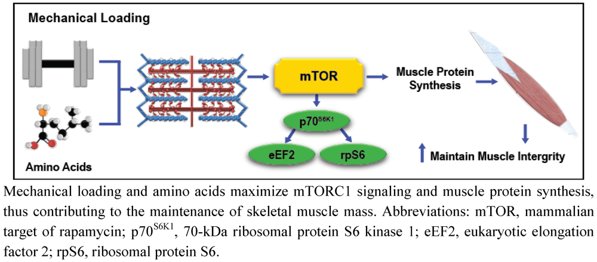

```{r setup, include=FALSE}
knitr::opts_chunk$set(echo = FALSE, warning= FALSE, message=FALSE, dpi = 300)
```


---
# The regression model 


```{r, fig.width = 7, fig.height = 4}


library(tidyverse)

## Make up some fake data
set.seed(666)


dat <- data.frame(vo2max = runif(24, min = 55, max = 75), 
           sex = rep(c("male", "female"), 12))  %>%
  mutate(vo2max = if_else(sex == "female", vo2max - 10, vo2max), 
         performance = 650 - vo2max * 2 + runif(24, min = -11, max = 11), 
         performance = if_else(sex == "female", performance + 12, performance)) 


m <- lm(performance ~ vo2max, data = dat) 


anno <- paste0("y = ", round(coef(m)[1],0), " + x \U00D7 ", round(coef(m)[2], 0))

dat %>%
  ggplot(aes(vo2max, performance)) + 
  geom_blank() +
  geom_abline(intercept = coef(m)[1], slope = coef(m)[2], color = "black" ) +
  
  scale_x_continuous(limits = c(0, 90)) +
  scale_y_continuous(limits = c(500, 690)) +
  
  labs(x = "x", 
       y = "y") +
  annotate("text", x = 50, y = 625, label = anno) +
  theme_minimal()
  
  


```

A univariate regression model can be expressed as $y=Intercept + x\times Slope$. 


---

# Building the model

A regression model built using observed data often contains some error:

$$y=Intercept + x\times Slope + Error$$
```{r, fig.width = 7, fig.height = 2.2}

dat$fitted <- fitted(m)

dat %>%
  ggplot(aes(vo2max, performance)) + 
  geom_point() +
  geom_abline(intercept = coef(m)[1], slope = coef(m)[2], color = "black" ) +
  
  
  geom_segment(aes(x = vo2max, xend = vo2max, y = fitted, yend = performance), 
               color = "red") +
  
  scale_x_continuous(limits = c(40, 85)) +
  scale_y_continuous(limits = c(500, 600)) +
  
  labs(x = "VO2max", 
       y = "Performance") +

  theme_minimal()
  
```

A more formal description of the model:
$$y_i = \beta_0 + \beta_1 x_i + \epsilon_i$$
where $y_i$ are the performance values for each participant $(i = 1, ..., n)$, $\beta_0$ is the intercept, $\beta_1$ is the slope and $\epsilon_i$ is the difference between each observation from its predicted values.

---

# Fitting the model in R

```{r, echo = TRUE, eval = FALSE}
model <- lm(performance ~ vo2max, data = dat)
```

```{r, echo = FALSE, eval = TRUE, results = "asis"}
library(knitr)

broom::tidy(m) %>%
  mutate(p.value = if_else(p.value < 0.001, "< 0.001", paste(" ", round(p.value, 3)))) %>%
  kable(digits = c(NA, 2, 2, 2, NA))

```

```{r, fig.width = 7, fig.height = 2.2}

dat$fitted <- fitted(m)

dat %>%
  ggplot(aes(vo2max, performance)) + 
  geom_point() +
  geom_abline(intercept = coef(m)[1], slope = coef(m)[2], color = "black" ) +
  
  
  geom_segment(aes(x = vo2max, xend = vo2max, y = fitted, yend = performance), 
               color = "red") +
  
  scale_x_continuous(limits = c(40, 85)) +
  scale_y_continuous(limits = c(500, 600)) +
  
  labs(x = "VO2max", 
       y = "Performance") +

  theme_minimal()
  
```

---

# How is the regression model contructed?

- We are trying to fit a line that most accurately predicts the observed points

- The "best fit line" minimizes distances from *predicted* values to *fitted values* (the best fit line).

```{r, fig.width = 7, fig.height = 2.2}

dat$fitted <- fitted(m)

dat %>%
  ggplot(aes(vo2max, performance)) + 
  geom_point() +
  geom_abline(intercept = coef(m)[1], slope = coef(m)[2], color = "black" ) +
  
  
  geom_segment(aes(x = vo2max, xend = vo2max, y = fitted, yend = performance), 
               color = "red") +
  
  scale_x_continuous(limits = c(40, 85)) +
  scale_y_continuous(limits = c(500, 600)) +
  
  labs(x = "VO2max", 
       y = "Performance") +

  theme_minimal()
  
```

---
# Additional information can improve the model

```{r, fig.width = 7, fig.height = 2.2}


colors <- c("#fc8d59", "#91bfdb")

dat$fitted <- fitted(m)

dat %>%
  ggplot(aes(vo2max, performance, fill = sex)) + 
  geom_point(shape = 21, size = 3) +
 # geom_abline(intercept = coef(m)[1], slope = coef(m)[2], color = "black" ) +
 # 
 # 
 # geom_segment(aes(x = vo2max, xend = vo2max, y = fitted, yend = performance), 
 #              color = "red") +
  
  scale_x_continuous(limits = c(40, 85)) +
  scale_y_continuous(limits = c(500, 600)) +
  scale_fill_manual(values = colors) +
  labs(x = "VO2max", 
       y = "Performance", 
       fill = "Sex") +

  theme_minimal()
  
```

---
# Additional information can improve the model

```{r, fig.width = 7, fig.height = 2.2}

m2 <- lm(performance ~ vo2max + sex, data = dat)

dat$fitted2 <- fitted(m2)


dat %>%
  ggplot(aes(vo2max, performance, fill = sex)) + 
  geom_point(shape = 21, size = 3) +
  geom_abline(intercept = coef(m)[1], slope = coef(m)[2], color = "black", lty = 2 ) +
  
  geom_abline(intercept = coef(m2)[1], slope = coef(m2)[2], color = colors[1], lty = 1 ) +
  geom_abline(intercept = coef(m2)[1] + coef(m2)[3], slope = coef(m2)[2], 
              color = colors[2], lty = 1 ) +
 

  
  scale_x_continuous(limits = c(40, 85)) +
  scale_y_continuous(limits = c(500, 600)) +
    scale_fill_manual(values = colors) +
  labs(x = "VO2max", 
       y = "Performance", 
       fill = "Sex") +

  theme_minimal()
  
```

---
# Additional information can improve the model

```{r, fig.width = 7, fig.height = 2.2}

m2 <- lm(performance ~ vo2max + sex, data = dat)

dat$fitted2 <- fitted(m2)

dat %>%
  ggplot(aes(vo2max, performance, fill = sex)) + 
  geom_point(shape = 21, size = 3) +
  geom_abline(intercept = coef(m)[1], slope = coef(m)[2], color = "black", lty = 2 ) +
  
  geom_abline(intercept = coef(m2)[1], slope = coef(m2)[2], color = colors[1], lty = 1 ) +
  geom_abline(intercept = coef(m2)[1] + coef(m2)[3], slope = coef(m2)[2], 
              color = colors[2], lty = 1 ) +
 # 
  geom_segment(aes(x = vo2max, xend = vo2max, y = fitted2, yend = performance), 
               color = "red") +
  
  scale_x_continuous(limits = c(40, 85)) +
  scale_y_continuous(limits = c(500, 600)) +
    scale_fill_manual(values = colors) +
  labs(x = "VO2max", 
       y = "Performance", 
       fill = "Sex") +

  theme_minimal()
  
```

---

# Minimizing the error of the model

```{r, results = "asis"}

broom::tidy(m) %>%
  mutate(Model = "Model 1") %>%
  rbind(broom::tidy(m2) %>%
          mutate(Model = "Model 2")) %>%
  dplyr::select(Model, term:p.value) %>%

  mutate(p.value = if_else(p.value < 0.001, "< 0.001", paste(" ", round(p.value, 3)))) %>%
  kable(digits = c(NA,NA, 2, 2, 2, NA))
```

```{r, fig.height=2.5, fig.width= 7}

colors2 <- c("#af8dc3", "#7fbf7b")


dat <- dat %>%
  mutate(error1 = (performance - fitted)^2, 
         error2 = (performance - fitted2)^2, 
         participant = paste0("p", seq(1:24)), 
         participant = factor(participant), 
         participant = fct_reorder(participant, error1))


dat %>%
  ggplot(aes(participant, sqrt(error1))) + 
  geom_bar(stat = "identity", 
                position = position_nudge(x = -0.2), 
                                              fill = colors2[2], color = colors2[2],
                                              width = 0.2) +
  geom_bar(aes(participant, sqrt(error2)), 
           stat = "identity", 
           fill = colors2[1], color = colors2[1],
                  position = position_nudge(x = 0.2), 
                        width = 0.2) +
  labs(y = expression(sqrt(fitted - predicted))) +
  
  theme_minimal() +
  theme(axis.text.x = element_blank(), 
        axis.title.x = element_blank()) +
  
  annotate("text", x = 5, y = 7.5, label = "Model 2", color = colors2[1]) +
  annotate("text", x = 20, y = 14, label = "Model 1", color = colors2[2]) 


```

---

# Dummy variables

* A dummy variable can be used in a regression model representing a qualitative variable (e.g. Male and Female) where the first **level** of the variable is **coded** $0$ and the second level is **coded** $1$

* In the regression model, the numerical coded variable is used, a simple uni-variate example:

```{r simple-dichotomous, fig.align='center',fig.height = 2, fig.width = 7}
set.seed(1)
df <- data.frame(x = c(0,0,0,0,0,0,0,0, 1,1,1,1,1,1,1,1), y = c(rnorm(8, 140, 10), rnorm(8, 170, 10)),
                 sex = c(rep("Female",8), rep("Male", 8)))


s <- df %>%
        group_by(x) %>%
        summarise(m = mean(y))  %>%
        data.frame()


df %>%
        ggplot(aes(x, y)) + geom_point(color = "#999999") + theme_classic() + 
        scale_x_continuous(breaks = c(0,1), expand = c(0.4, 0.4)) + 
        geom_segment(x = 0, xend = 0.5, y = s[1,2], yend = s[1,2]) +
        geom_segment(x = 0.5, xend = 0.5, y = s[1,2], yend = s[2,2]) +
        geom_segment(x = 0.5, xend = 1, y = s[2,2], yend = s[2,2]) + 
        annotate("text", x = -0.5, y = s[1,2], 
                 label = paste("beta[0]==", round(s[1,2],1)), parse = TRUE) +
        annotate("text", x = 0, y = s[2,2], 
                 label = paste("beta[1]==", round(s[2,2]-s[1,2],1)), parse = TRUE) +
        annotate("text", x = -0.6, y = s[2,2]+10, 
                 label = paste("y == beta[0] + beta[1]*X[1]"), parse = TRUE)
```


---

# Dummy variables

* In the case of Female and Male the dummy variable for sex is coded

if $sex = Female$ then $X = 0$

if $sex = Male$ then $X = 1$

Mean values for women:

$$y = \beta_0 + \beta_1 \times 0 = \beta_0$$

Mean values for men:

$$y = \beta_0 + \beta_1 \times 1 = \beta_0 + \beta_1$$

---


# Dummy variables can used to code more levels than 2

* Using dummy variables, more **levels** can be coded into the model
* More parameters will have to be estimated, if three groups ($A$, $B$ and $C$) are to be included in the model, 3-1 dummy variables are needed

If $group = A$ then $X_1 = 0, X_2 = 0$

If $group = B$ then $X_1 = 1, X_2 = 0$

If $group = C$ then $X_1 = 0, X_2 = 1$

---

# Dummy variables can be used to control for group effects

* Simpson's paradox is when **marginal** and **partial** relationships in the data set have different signs, i.e. a positive relationship in the whole data-set and negative relationships within subgroups

```{r simpsons-paradox, fig.align='center',fig.height = 3, fig.width = 7}
set.seed(1)

x <- runif(40, 10, 20)

y1 <- 1400 + (-15)*x + rnorm(40, 0, 100)

y2 <- 1840 + (-15)*x + rnorm(40, 0, 100)


df <- data.frame(x = c(x, x+5), y = c(y1, y2), Group = c(rep("G1", 40), rep("G2", 40)))


df %>%
        ggplot(aes(x, y)) + geom_point() + geom_smooth(method = "lm") + 
        geom_smooth(aes(color = Group), method = "lm") + theme_classic()

```

---

# Dummy variables can be used to control for group effects

```{r simpsons-paradox-regressions, results='asis'}
library(knitr)
mod1 <- lm(y ~ x, data = df)
mod2 <- lm(y ~ x + Group, data = df)


kable(coef(summary(mod1))[,c(1:3)], "html", 
      booktabs = TRUE,
      caption = "Simple model", digits =c(2,2,2))

```

```{r simpsons-paradox-regressions2, results='asis'}

kable(coef(summary(mod2))[,c(1:3)], "html", 
      booktabs = TRUE,
      caption = "Controlling for groups", digits =c(2,2,2))

```

---


---

# Estimation, an example

```{r, fig.align = 'center', fig.dim = c(4,1.5)}
df <- data.frame(m = c(2, 1.8), error = c(1.9, 2.3), Study = c("A", "B"))
df %>%
        ggplot(aes(m , Study, fill = Study)) + 
        
        geom_errorbarh(aes(xmin = m-error, xmax = m+error), height = 0.2) +
        geom_point(size = 3, shape = 21) + 
        xlab("Effect") + ylab("Study")+
        annotate("text", x=1, y=1.3, label= paste("p-value", "==0.03"), parse = TRUE) +
        annotate("text", x=1, y=2.3, label= paste("p-value", "==0.13"), parse = TRUE) +
        theme_classic()
```

- What conclusions can be drawn from the two studies (using NHST vs. estimation)?

<font size = "3">
Example from: Cumming, G. (2012). **Understanding the new statistics : effect sizes, confidence intervals, and meta-analysis**. New York, Routledge.
</font>

---

# Estimation

- In addition to giving a interval representing the precision of the estimate, the confidence interval can be used to assess the clinical importance of a study. 
- Are values inside the confidence interval large (or small) enough to care about in a clinical sense (e.g. weight gain study)

---


---

# Issues in studies of association

* Influential data points
* Correlation does not imply causation
* Regression towards the mean

---

# Influential data points -- mTOR signaling and exercise induced muscle hypertrophy

```{r echo=FALSE, out.width='100%', fig.align='center'}

```

<font size=2>
Pasiakos, S. M. (2012). "Exercise and Amino Acid Anabolic Cell Signaling and the Regulation of Skeletal Muscle Mass." Nutrients 4(7).
</font>

---

# Exercise induced P70 S6-kinase phosphorylation predicts muscle hypertrophy (Mitchell et al. 2013)

```{r mitchell, fig.align='center', fig.height = 3, fig.width = 7}

library(tidyverse); library(readxl)

s <- read_excel("./data/Mitchell2013.xlsx") %>%
        summarise(iqr = IQR(p70),
                  q1 = quantile(p70, 0.25), 
                  q3 = quantile(p70, 0.75),
                  upper.bound = q3 + iqr*1.5, 
                  lower.bound = q1 - iqr*1.5,
                  iqr.csa = IQR(CSA),
                  q1.csa = quantile(CSA, 0.25), 
                  q3.csa = quantile(CSA, 0.75),
                  upper.bound.csa = q3.csa + iqr.csa*1.5, 
                  lower.bound.csa = q1.csa - iqr.csa*1.5) 

read_excel("./data/Mitchell2013.xlsx") %>%
        ggplot(aes(p70, CSA)) + geom_point(size = 2, alpha = 0.6, shape = 21, fill = "#E69F00") +
     #  geom_vline(xintercept = s$upper.bound) +
     #  geom_vline(xintercept = s$lower.bound) +
     #  geom_hline(yintercept = s$upper.bound.csa) +
     #  geom_hline(yintercept = s$lower.bound.csa) +
     #   annotate("text", x = 3, y = s$upper.bound.csa + 3, label = "Q3 + 1.5 IQR", size = 3) +
     #   annotate("text", x = 3, y = s$lower.bound.csa + 3, label = "Q1 - 1.5 IQR", size = 3) +
     #   annotate("text", x = s$upper.bound+0.1, y = 25, label = "Q3 + 1.5 IQR", angle = 90, size = 3) +
     #   annotate("text", x = s$lower.bound+0.1, y = 25, label = "Q1 - 1.5 IQR", angle = 90, size = 3) +
        theme_classic() +
       geom_smooth(method = "lm", color = "#999999", fill = "#E69F00")

```

<font size=2>
Mitchell, C. J., et al. (2013). "Muscular and Systemic Correlates of Resistance Training-Induced Muscle Hypertrophy." PLoS One 8(10): e78636.
</font>

---

# Influential data points

* Data points that substantially deviates from the rest of the data may affect the interpretation of regression models.

--

* "Leverage" is the effect each data point has on the model, unusual X-values produces larger leverage

--

* This can be assessed by looking at the graph, and numerically

--

* A tool in simple regression would be to assess outliers (in the X-axis) on model characteristics

---

# Detect outliers

* An outlier is defined as $Q3/Q1 \pm 1.5 \times IQR$

```{r mitchell-fig2, fig.align='center',fig.height = 3.2, fig.width = 7}
library(tidyverse); library(readxl)

s <- read_excel("./data/Mitchell2013.xlsx") %>%
        summarise(iqr = IQR(p70),
                  q1 = quantile(p70, 0.25), 
                  q3 = quantile(p70, 0.75),
                  upper.bound = q3 + iqr*1.5, 
                  lower.bound = q1 - iqr*1.5,
                  iqr.csa = IQR(CSA),
                  q1.csa = quantile(CSA, 0.25), 
                  q3.csa = quantile(CSA, 0.75),
                  upper.bound.csa = q3.csa + iqr.csa*1.5, 
                  lower.bound.csa = q1.csa - iqr.csa*1.5) 

read_excel("./data/Mitchell2013.xlsx") %>%
        mutate(infl = if_else(p70 > s$upper.bound, "infl", "ok")) %>%
        ggplot(aes(p70, CSA, fill = infl)) + geom_point(size = 2, alpha = 0.6, shape = 21) +
       geom_vline(xintercept = s$upper.bound) +
       geom_vline(xintercept = s$lower.bound) +
       geom_hline(yintercept = s$upper.bound.csa) +
       geom_hline(yintercept = s$lower.bound.csa) +
        annotate("text", x = 3, y = s$upper.bound.csa + 3, label = "Q3 + 1.5 IQR", size = 3) +
       annotate("text", x = 3, y = s$lower.bound.csa + 3, label = "Q1 - 1.5 IQR", size = 3) +
       annotate("text", x = s$upper.bound+0.1, y = 25, label = "Q3 + 1.5 IQR", angle = 90, size = 3) +
        annotate("text", x = s$lower.bound+0.1, y = 25, label = "Q1 - 1.5 IQR", angle = 90, size = 3) +
        scale_fill_manual(values = c("#999999", "#E69F00"))+
        theme_classic() +
        theme(legend.position = "none") 
       # geom_smooth(method = "lm", color = "#999999")


```


---


# Re-do analysis without outlier

```{r mitchell-fig3, fig.align='center',fig.height = 3.2, fig.width = 7}
library(tidyverse); library(readxl)


read_excel("./data/Mitchell2013.xlsx") %>%
        mutate(infl = if_else(p70 > s$upper.bound, "infl", "ok")) %>%
        ggplot(aes(p70, CSA, fill = infl)) + geom_point(size = 2, alpha = 0.6, shape = 21) +
     # geom_vline(xintercept = s$upper.bound) +
     # geom_vline(xintercept = s$lower.bound) +
     # geom_hline(yintercept = s$upper.bound.csa) +
     # geom_hline(yintercept = s$lower.bound.csa) +
     #  annotate("text", x = 3, y = s$upper.bound.csa + 3, label = "Q3 + 1.5 IQR", size = 3) +
     # annotate("text", x = 3, y = s$lower.bound.csa + 3, label = "Q1 - 1.5 IQR", size = 3) +
     # annotate("text", x = s$upper.bound+0.1, y = 25, label = "Q3 + 1.5 IQR", angle = 90, size = 3) +
     #  annotate("text", x = s$lower.bound+0.1, y = 25, label = "Q1 - 1.5 IQR", angle = 90, size = 3) +
        scale_fill_manual(values = c("#999999", "#E69F00"))+
        theme_classic() +
        theme(legend.position = "none") +
        geom_smooth(method = "lm", color = "#999999")


```

What can we conclude from the Mitchell data-set?

---

# Graphical evaluation of regression models
```{r, eval = FALSE, echo = TRUE}
dat <- read_excel("./data/Mitchell2013.xlsx") # Import the data
m <- lm(CSA ~ p70, data = dat) # Fitting the model
plot(m) # Create diagnostic plots of the model
```


---

```{r, eval = TRUE, echo = FALSE}
dat <- read_excel("./data/Mitchell2013.xlsx") # Import the data
m <- lm(CSA ~ p70, data = dat) # Fitting the model
par(mfrow = c(3, 2))
plot(m)
par(mfrow = c(1,1))

```

---


# Regression towards the mean

* Francis Galton analyzed parents and children heights to study heritability (how much of a trait can be explained by genetics?)
* Does parents heights determine children heights?

---

# Regression towards the mean

```{r galton, fig.align='center',fig.dim = c(4,2.5)}

library(mosaicData)

data(Galton)
Galton %>%
                mutate(father = father * 2.54,
                       mother = mother * 2.54,
                       height = height * 2.54,
                       sex = factor(sex, levels = c("F", "M"), labels = c("Female", "Male"))) %>%
                gather(parent, p.height, father:mother) %>%
                ggplot(aes(height, color = sex, fill = sex)) + geom_histogram(alpha=0.5, position="dodge") +
                scale_color_manual(values=c("#999999", "#E69F00", "#56B4E9"), name = "") + 
                scale_fill_manual(values=c("#999999", "#E69F00", "#56B4E9"), name = "") +
                theme_classic() + 
        theme(axis.title = element_text(size = 10),
              axis.text = element_text(size = 10)) +
                xlab("Children heights (cm)") + ylab("Count")
```

* Do tall parents have tall children?

---

# Regression towards the mean

* If parents heights would predict children heights, what would the regression line look like? 

```{r galton-hypothesis, fig.align='center',fig.dim = c(4,2.5)}

df <- data.frame(x = c(140, 200), y = c(140, 200))

df %>%
        ggplot(aes(x, y)) + geom_point(color = "white") + theme_classic() + 
        xlab("Parent height (cm)") + ylab("Children height (cm)") +
        geom_segment(aes(x = 150, xend = 190, y = 150, yend = 190), color = "#999999", size = 1.5) +
        geom_segment(aes(x = 160, xend = 180, y = 150, yend = 190), color = "#E69F00", size = 1.5) +
        geom_segment(aes(x = 140, xend = 200, y = 150, yend = 190), color = "#56B4E9", size = 1.5) +
        annotate("text", x = 180, y = 194, label = "a") +
        annotate("text", x = 190, y = 194, label = "b") +
        annotate("text", x = 200, y = 194, label = "c") +
        
        annotate("text", x = 145, y = 190, label = expression(a:~~~ beta[1] > 1)) +
        annotate("text", x = 145, y = 185, label = expression(b:~~~ beta[1] == 1)) +
        annotate("text", x = 145, y = 180, label = expression(c:~~~ beta[1] < 1)) 


```

---

# Regression towards the mean

* Regression towards the mean predicts that upon repeated sampling from a normal distribution, extreme values will be less frequent than values close to the mean.
* An extreme value **within** a family will be "replaced" by a less extreme.
* How would the regression line look?

---

# Regression towards the mean

```{r, fig.align='center',fig.dim = c(4,2.5)}
Galton %>%
        mutate(father = father * 2.54,
               mother = mother * 2.54,
               height = height * 2.54) %>%
        gather(parent, p.height, father:mother) %>%
        mutate(sex = factor(sex, levels = c("F", "M"), labels = c("Female", "Male")),
               parent = factor(parent, levels = c("father", "mother"), labels = c("Father", "Mother"))) %>%
        ggplot(aes(p.height, height)) + geom_point(alpha = 0.2) +
        facet_grid(sex~parent) +
        geom_segment(aes(x = 145, xend = 200, y = 140, yend = 200), color = "#56B4E9", size = 1) +
        geom_smooth(method = "lm",  se = FALSE, color = "#E69F00", size = 1) + 
        scale_x_continuous(limits = c(140, 210)) +
        scale_y_continuous(limits = c(140, 210)) +
        theme_classic() +
        xlab("Parent height (cm)") + ylab("Children height (cm)")

```

---

# Regression towards the mean

* This poses a problem when analyzing baseline characteristics and change due to training 
```{r echo=FALSE, out.width='70%', fig.align='center'}
knitr::include_graphics('./img/geRegression.jpg')
```


When using a correction "*...to minimize the effect* [of regression to the mean], *the correlations in the present study were weakened.*"

<font size=2>
Skovereng, K., et al. (2018). "Effects of Initial Performance, Gross Efficiency and O~2peak~ Characteristics on Subsequent Adaptations to Endurance Training in Competitive Cyclists." Front Physiol 9(713).
</font>

---


