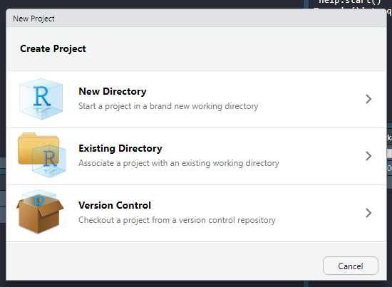
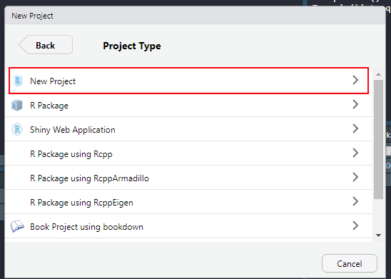

## Projects
Before starting a new data analysis project, it is good to have an idea about how to organize it. An efficient way to organize a data analysis using R Studio is to use [Projects](https://support.rstudio.com/hc/en-us/articles/200526207-Using-Projects).

A project is essentially a file keeping track of your analysis. When starting a new project, it also defines your *working directory*. A *working directory* is the top directory of the file system that contains files needed for the analysis. The top directory (or root directory) may contain several subfolders that all can be accessed using relative paths. I talked about this on the page [creating reports using R, R Markdown and knitr](lesson_2_markdown.html). The same logic applies to *Projects* as with *knitting* a R Markdown file. When setting the working directory using *Projects* you can use relative paths for files like data files. This means you can copy your project (and folder) to another place and it will still work.

A project should be self-contained, meaning that all scripts should be able to run based on the information that is in the project folder. If your analyses depends on something (e.g. a script) outside the project, your analyses are not reproducible unless you also share the external file. 

Data can be collected from external sources, but do this with a script!

To organize your project, think about it as a folder, containing several sub-folder.

The root folder is the uppermost level in the folder structure. In this folder you can have report files (R-markdown files). This is a good idea as when you compile them, they will have the same folder structure as your project. 

The R folder contains scripts, all written to perform specific tasks (see below). The data folder contains data used in analyses. I like to have a derived_data-folder, here I gather data that has been created with scripts. An output folder can be used to gather reports and figures that you create.

Additional folders could be `./figures/`, contains scripts to create figures, and the figure files. `./resources/` where stuff needed to create reports are stored, for example the bibliography file or word template files

The root directory contains a R markdown file used to write the report. I wish to keep this folder as clean as possible. Keeping the R markdown file in the root directory makes it easy to use the same relative paths when working in a R script and knitting the report. 

## Structuring your course directory

When doing this course, we will do several analyses. I suggest keeping them all in one project. Keep your data in a folder called `./data`, keep R scripts in the `./R` folder and so on. Keep R markdown files in the main (root/top) directory. Create the course directory using Project in R Studio. 

### Starting a project
Start a new project by clicking in the right upper corner ()

You will be asked what kind of project you want to start. A new directory will launch a new folder. Existing directory will let you select a folder where you want to have your project. Version control is very good to have, especially when collaborating or when you do big project. This lets you track changes that are made and store your scripts online. It requires [GitHub](www.github.com) or similar version control system. We will not cover it in this course, but I recommend interested students to discover it by yourself.

When you select "New directrory" you will be asked, dependning on your configuration, what type of project you want to start. Choose "New Project", this is generic and suited to our needs. 

Select a good name for your project (specific enough so you can easily find it). And choose the location where you want it on your local computer.

Done! When your are active in a project, RStudio will show you the name of the project in the upper right corner.

The Files tab will show an almost empty folder. The only file should be the project file. This file contains information about the project needed when you want to launch it again. You can also launch the project by double clicking it (this will start RStudio). If you click it from whitin RStudio, you will be able to control some settings. 

By now you should have set the .RData/workspace settings to facilitate reproducible workflow (see previous page). Do not save works pace on exit.

